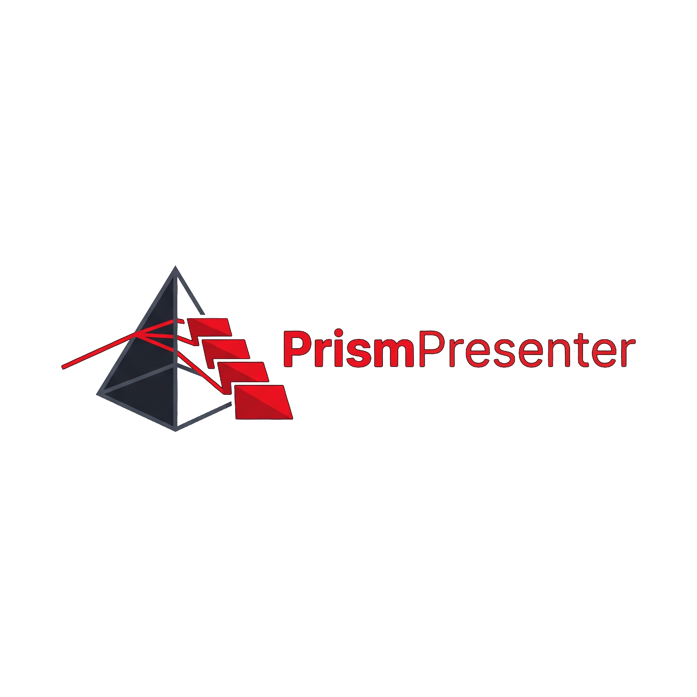
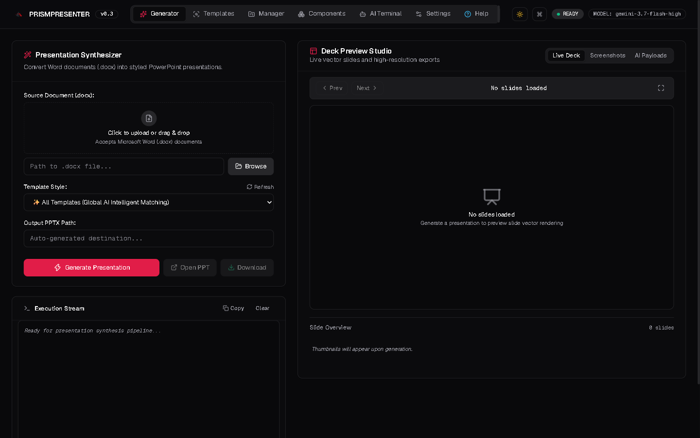
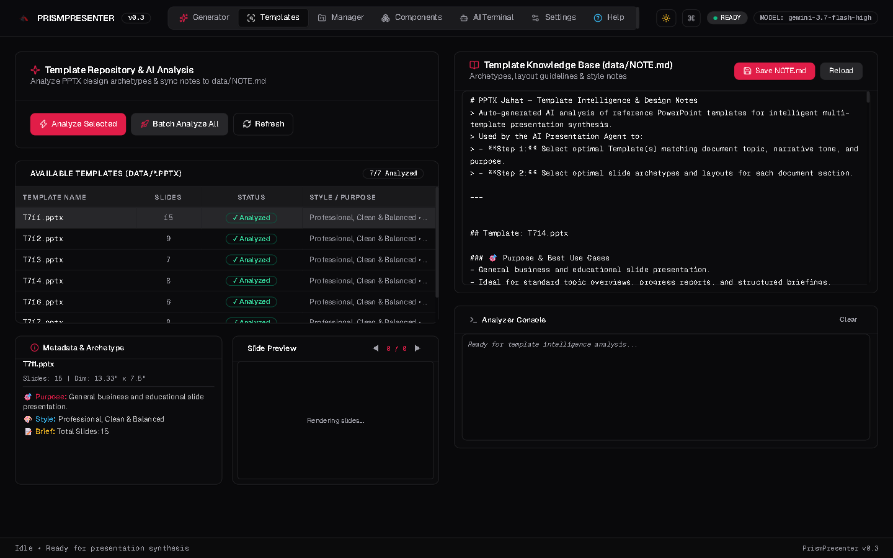
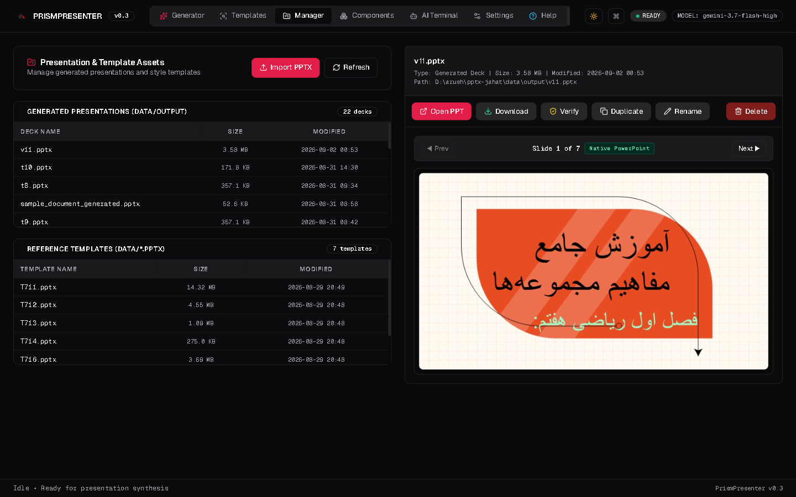
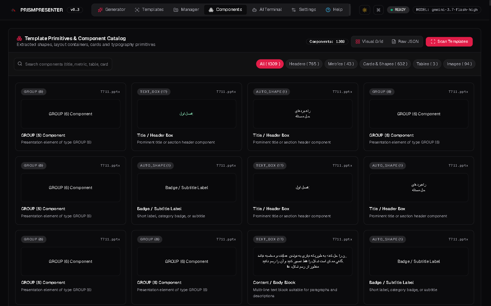
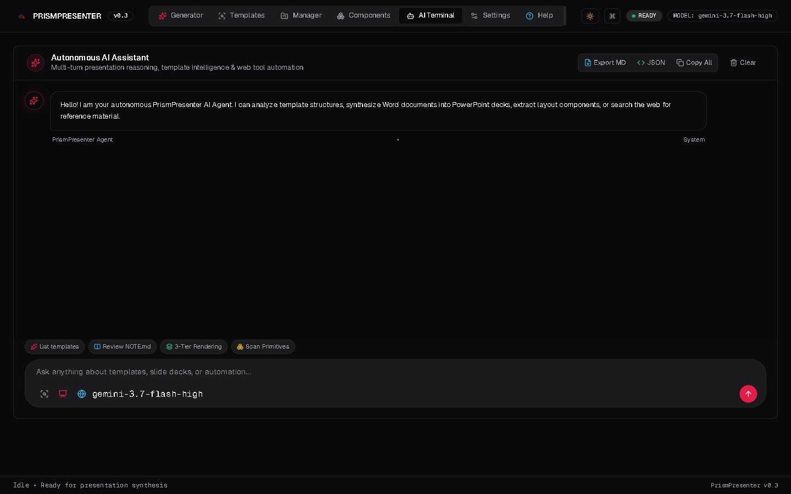
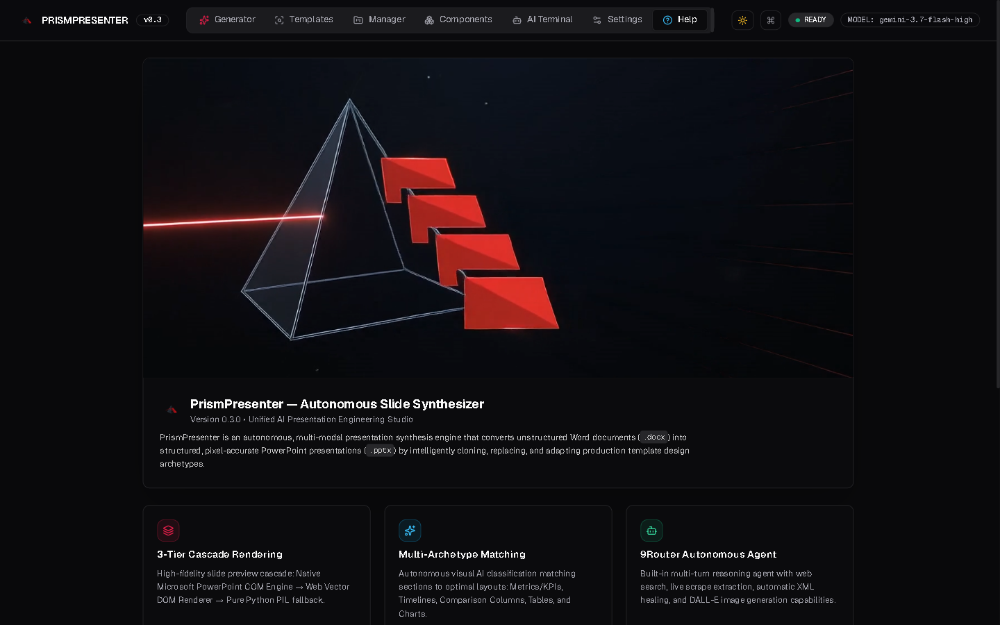

# PrismPresenter ⚡

<div align="center">



**Autonomous Multi-Modal AI Presentation Studio & Template Synthesizer**

[](https://www.python.org/downloads/)
[](LICENSE)
[](https://github.com/ARUSH221617/PrismPresenter)
[](https://tailwindcss.com)

</div>

---

## 📖 Overview

**PrismPresenter** converts raw Word documents (`.docx`) into production-grade, pixel-perfect PowerPoint presentations (`.pptx`). Instead of generating generic bulleted slides, PrismPresenter analyzes reference presentation design archetypes, clones slide layouts, preserves fonts and branding, synthesizes context-aware visuals, and infills content using **9Router** multi-modal vision and reasoning models.

---

## 📸 Studio Interface Preview

### 1. Slide Generator & Synthesis Studio
Upload Word documents, select reference templates, stream real-time AI generation logs, and preview slide decks.



---

### 2. Template Intelligence & Style Inspector
Scan reference presentation templates, inspect AI-classified slide archetypes, and manage `NOTE.md` design rules.



---

### 3. Deck & Template Manager
Inspect, verify XML package integrity, repair, duplicate, download, and launch presentations.



---

### 4. Visual Component Primitives Catalog
Search and browse extracted shapes, KPI cards, metric callouts, and extracted visual assets with an interactive JSON schema inspector.



---

### 5. Google Gemini-Style Autonomous AI Terminal
Multi-turn agent chat with active tool filters (Web Search, Live Scraper, PPTX Generator, Template Memory) and collapsible reasoning trace drawers.



---

### 6. Help & Architecture Pipeline
Built-in workflow guide, brand motion reveal, pipeline breakdown, and author contact.



---

## ✨ Key Features

- **Document Ingestion**: Parses raw `.docx` files into structured semantic sections, hierarchy trees, metrics, and tables.
- **Template Intelligence (`NOTE.md`)**: Scans reference PPTX templates and classifies slides into archetypes (KPI metrics, comparison columns, flowcharts, timelines, data tables, and hero layouts).
- **Exact Layout Cloning & Infill**: Clones template slides across presentations, preserving exact shape geometries, typography, themes, and RTL (Persian/Arabic) alignment.
- **3-Tier Slide Rendering Cascade**:
  1. *Tier 1 (Native COM)*: Windows PowerPoint export for pixel-perfect fidelity.
  2. *Tier 2 (Vector DOM)*: Interactive client-side HTML5/SVG vector renderer.
  3. *Tier 3 (Pure Python PIL)*: Fallback slide renderer for headless environments.
- **Google Gemini-Style AI Terminal**: Multi-turn agent chat with tool execution streaming, collapsible reasoning traces, suggestion chips, and Markdown snippet export.
- **Visual Component Primitives Catalog**: Searchable card grid previewing extracted shapes, cards, metric callouts, and images.
- **AI Image Synthesis**: Contextual slide illustrations and graphics generated on demand via 9Router image endpoints (`gemini-3-pro-image-preview`, `dall-e-3`, `flux`).
- **Dark / Light Mode UI**: Modern Tailwind CSS and shadcn/ui design tokens with persistent theme states and full mobile/tablet responsiveness.

---

## 🏗️ Architecture Pipeline

```
[Uploaded Word .docx]               [Selected Template / data/*.pptx]
        │                                           │
        ▼ (Step 1: Document Ingestion)              ▼ (Step 2: Template Intelligence)
[Parse Sections & Content]                 [Classify Archetypes & NOTE.md]
        │                                           │
        └─────────────────────┬─────────────────────┘
                              │
                              ▼
        +───────────────────────────────────────────+
        │    Step 3: 9Router AI Agent Reasoning     │
        │   - Multimodal Vision slide inspection    │
        │   - Maps doc sections to slide slots      │
        │   - Dynamic multi-template slide matching │
        │   - Tool filtering (Search / Synthesis)   │
        +───────────────────────────────────────────+
                              │
                              ▼
        +───────────────────────────────────────────+
        │   Step 4: Slide Cloning & In-Place Infill │
        │   - Cross-presentation slide cloning      │
        │   - Safe text frame & font preservation   │
        │   - Persian/Arabic RTL alignment support  │
        +───────────────────────────────────────────+
                              │
                              ▼
        +───────────────────────────────────────────+
        │   Step 5: 3-Tier Cascade Preview Engine   │
        │   Tier 1: Native PowerPoint COM (Windows) │
        │   Tier 2: Web Vector Engine (HTML5/DOM)   │
        │   Tier 3: Pure-Python PIL SlideRenderer   │
        +───────────────────────────────────────────+
                              │
                              ▼
        [Output Generated PPTX & Web Studio Preview]
```

---

## 🚀 Quick Start

### 1. Prerequisites

- Python 3.11 or higher
- Optional (Windows): Microsoft PowerPoint installed for Tier-1 native COM rendering

### 2. Installation

Clone repository and install dependencies:

```bash
git clone https://github.com/ARUSH221617/PrismPresenter.git
cd PrismPresenter
pip install -e .
```

Or using `uv`:

```bash
uv pip install -e .
```

### 3. Environment Setup

Create `.env` file in root directory:

```env
NINEROUTER_URL=http://localhost:20128
NINEROUTER_KEY=your_api_key_here
NINEROUTER_CHAT_MODEL=ag/gemini-3.7-flash-high
NINEROUTER_SEARCH_MODEL=tavily
NINEROUTER_FETCH_MODEL=jina-reader
NINEROUTER_IMAGE_MODEL=gemini/gemini-3-pro-image-preview
RENDER_MODE=auto
PORT=5000
HOST=127.0.0.1
```

### 4. Running the Application

#### Web GUI Studio (Default)
```bash
python -m pptx_jahat
```
Launches Flask web studio at `http://127.0.0.1:5000` and opens browser automatically.

#### Interactive CLI Agent
```bash
python -m pptx_jahat --cli
```

---

## 🖥️ Studio Tabs & Features

| View / Tab | Description |
| :--- | :--- |
| **Generator** | Upload Word docx, select template, stream real-time AI synthesis logs, and preview generated slides. |
| **Templates** | Manage template knowledge base, inspect template archetype classifications, and edit `NOTE.md`. |
| **Manager** | Inspect, verify, repair, rename, duplicate, and download generated presentations and templates. |
| **Components** | Explore extracted visual primitives, headers, callouts, cards, and image assets with JSON schema viewer. |
| **AI Terminal** | Gemini-style chat terminal with tool toggles (Search, Scrape, PPTX Gen, NOTE.md) and live execution reasoning drawer. |
| **Settings** | Configure 9Router endpoints, model targets, and rendering modes directly from UI. |
| **Help** | Brand reveal video, end-to-end architecture breakdown, and author contact. |

---

## ⌨️ Keyboard Shortcuts

- `1` - `7`: Switch between studio tabs
- `F`: Toggle Fullscreen Slide Lightbox in Preview
- `Left` / `Right` Arrow Keys: Navigate slides in preview mode
- `Ctrl` + `Enter`: Send message in AI Agent terminal

---

## 👤 Author & Contact

- **Author**: Amirreza Uneszadeh Shirazi (ARUSH)
- **Email**: [arush221617@gmail.com](mailto:arush221617@gmail.com)
- **GitHub**: [https://github.com/ARUSH221617/PrismPresenter](https://github.com/ARUSH221617/PrismPresenter)

---

## 📄 License

This project is licensed under the MIT License — see [LICENSE](LICENSE) for details.
